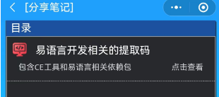

### 开发所需工具下载地址

* 百度网盘 分享：  
链接：https://pan.baidu.com/s/17tOjtFLkF5TK_gfgMMq01A  
* 提取码(请使用微信扫描小程序二维码进行查看)(为了恰饭)：  

* 查看步骤如下：  

* 系统环境： Windows 10 x64

### 工具使用说明
* 下载下来后的步骤
* 1 - 安装 “CheatEngine74”
* 2 - 解压绿色免安装版的易语言开发工具 “e_5.93_Green.7z”
* 3 - 再解压 “内存读写支持库2.3.zip”，并根据里面的说明文件把其中的两个关键文件放到 “e_5.93_Green” 的 lib 和 static-lib 目录下
* 4 - 用易语言开发工具打开这里的“真单就心丸_轮回修仙路_数据工程.e”工程的时候，记得要引用这里的 “精易模块V7.6.5” 目录下的 “精易模块[v7.6.5].ec” 工具包

### 使用声明

* 此项目主要是用于技术分享，本人以游戏爱好为由来督促自己学习汇编知识，同时会根据自己的学习深入来不定时更新这份代码，也会分享出我的学习知识
* 本项目遵照MIT协议开放源代码，使用时请务必遵循相关协议，切勿违法法律道德，切勿影响他人利益，否则一切后果请自行承担与本项目作者无关